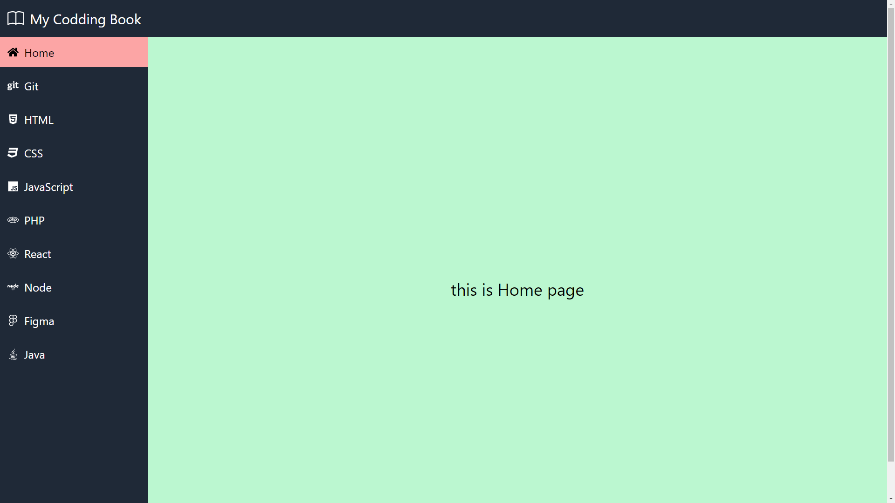

> 3 - Jun - 2022

# Tailwind | NavBar + SideBar + SideBarPages

## Demo 



<br />

# Git Branches System...


`git branch`


> 1
```
git checkout -b <Your-Given-Branch-Name>
```

> 2
``` 
git rm -rf .
```

> 3
```
git commit -am 'remove all file from parent branch'
```

*** 

> 4
```
git status
```

`Go & copy past here, your other project files source code`

> 5
```
git add .
```

> 6
```
git commit -am 'Your Logical Message ==> OK'
```

> 7
```
git push origin <Your-Given-Branch-Name>
```
